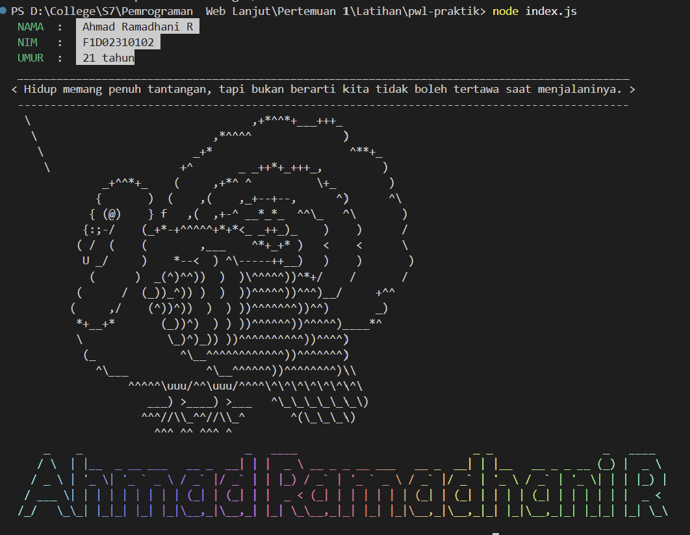

# Tugas 1 — Node.js Plugins: Chalk, Cowsay, Figlet

**Mata Kuliah:** Pemrograman Web Lanjut  
**Pertemuan:** 1 — Lanjutan Materi 1: Lingkungan Kerja JavaScript

## Identitas Mahasiswa

| Keterangan | Detail |
|---|---|
| Nama | Ahmad Ramadhani R |
| NIM | F1D02310102 |


## Deskripsi

Project ini dibuat untuk mempraktikkan penggunaan package Node.js melalui `chalk`, `cowsay`, dan `figlet`. Program menampilkan informasi mahasiswa, pesan motivasi dalam bentuk ASCII art, serta nama lengkap dengan efek warna dan gradasi.

Package tambahan yang digunakan adalah `gradient-string` dan `dayjs`.

## Package yang Digunakan

- **Chalk** — Mengatur warna dan gaya teks pada terminal.
- **Cowsay** — Menampilkan pesan motivasi dalam bentuk ASCII art.
- **Figlet** — Mengubah teks menjadi ASCII art.
- **Gradient-string** — Memberikan efek gradasi warna pada teks.
- **Day.js** — Menghitung umur berdasarkan tanggal lahir.

## Fitur Program

1. Menampilkan nama lengkap dan NIM menggunakan `chalk`.
2. Menampilkan umur menggunakan `dayjs`.
3. Menampilkan pesan motivasi menggunakan `cowsay` dengan karakter `turkey`.
4. Menampilkan nama lengkap dalam bentuk ASCII art menggunakan `figlet`.
5. Memberikan efek gradasi warna menggunakan `gradient-string`.

## Instalasi Dependensi

Pastikan Node.js dan npm telah terpasang pada perangkat.

Install seluruh dependensi menggunakan perintah berikut:

```bash
npm install
```

Jika ingin memasang package secara manual:

```bash
npm install chalk cowsay figlet gradient-string dayjs boxen
```

## Cara Menjalankan Program

Jalankan program menggunakan perintah berikut:

```bash
node index.js
```

Program akan menampilkan informasi mahasiswa, umur, pesan motivasi, dan nama dalam bentuk ASCII art pada terminal.

## Screenshot Output



## Struktur Project

```
T1-Node-Plugin/
├── node_modules/
├── screenshot/
├─────screenshot.png
├── index.js
├── package.json
├── package-lock.json
└── README.md
```